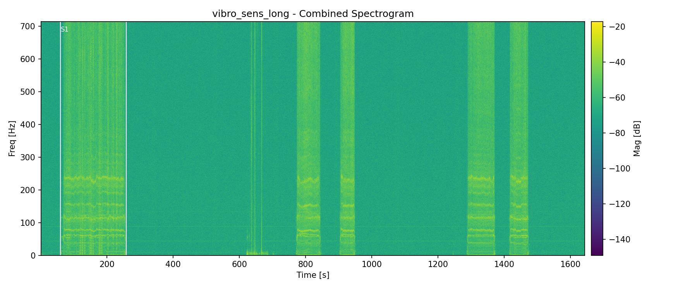
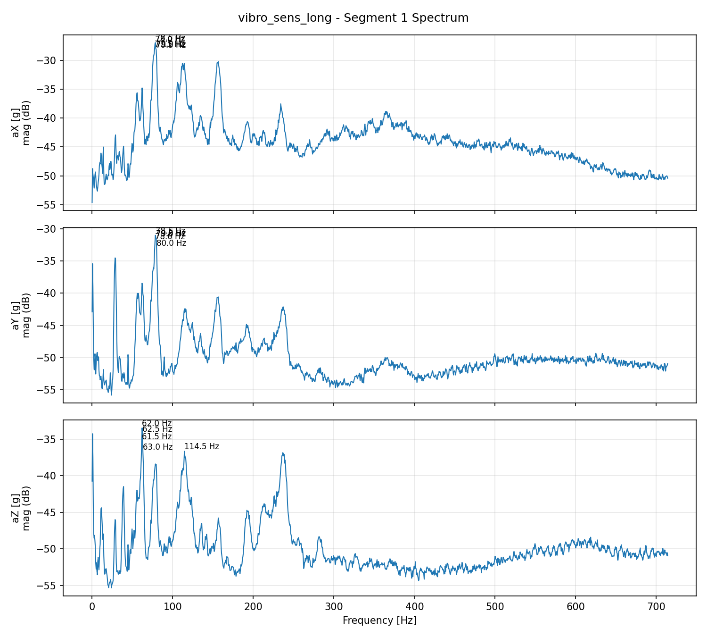

# VibroSens Analysis Tools

This folder contains four Python scripts for analyzing vibration data from PCE-VDL 24L 3-axis sensor.

## Which script should I use?
Quick guide:
- `gui_vibro.py` for interactive file pick + time window + plots + metrics.
- `analyze_vibro.py` for batch spectra/spectrograms with automatic segmentation.
- `interactive_spectrogram.py` for interactive spectrograms in HTML.
- `quantify_vibro.py` to compare vibration metrics across tests.

## Requirements
- Python 3.10+
- Packages: `numpy`, `scipy`, `matplotlib`
- Optional (for interactive HTML): `plotly`

Install dependencies:
```bash
python -m pip install numpy scipy matplotlib plotly
```

## 1) analyze_vibro.py
Batch analysis: spectra + spectrograms + automatic segmentation.

Basic usage:
```bash
python analyze_vibro.py vibro_sens_long.csv
```

Outputs are written to:
```
analysis_outputs/<file-base>/
```

Energy-based segmentation (adaptive threshold):
```bash
python analyze_vibro.py vibro_sens_long.csv \
  --segment-mode energy \
  --energy-k 6 \
  --min-segment-sec 10 \
  --min-gap-sec 10
```

Manual time window (seconds from start):
```bash
python analyze_vibro.py vibro_sens_long.csv \
  --segment-mode manual \
  --segment-start 12.5 \
  --segment-end 38.0
```

Key options:
- `--segment-mode gap|energy|manual` (default: gap)
- `--segment-start` / `--segment-end` (manual window in seconds)
- `--energy-k` (MAD multiplier for energy thresholding)
- `--min-segment-sec` (minimum flight duration)
- `--min-gap-sec` (minimum gap between flights)
- `--energy-window-sec` (RMS smoothing window)
- `--output-dir` (custom output folder)

Outputs include:
- `*_segmentN_spectrum.png`
- `*_segmentN_spectrogram.png`
- `*_combined_spectrogram.png`
- `*_summary.txt`

Example outputs:






## 2) interactive_spectrogram.py
Interactive spectrogram viewer. Works in headless mode via Plotly HTML.

Single axis (combined magnitude):
```bash
python interactive_spectrogram.py vibro_sens_long.csv --axis mag --plotly-out vibro_mag.html
```

All axes stacked:
```bash
python interactive_spectrogram.py vibro_sens_long.csv --axis all --plotly-out vibro_all_axes.html
```

Example (stacked axes):


Useful options:
- `--axis ax|ay|az|mag|all`
- `--fmax 300` (limit max frequency shown)
- `--max-samples 300000` (downsample for speed)
- `--nperseg 2048 --noverlap 1536` (STFT windowing)

Interactive time-range selection (Matplotlib GUI):
- Press `s` to set range start at the cursor time.
- Press `e` to set range end at the cursor time.
- Press `c` to clear the selection.
- When both are set, peak frequencies for the selected window are printed.

### Notes
- The Matplotlib GUI backend does not work in headless environments. Use
  `--plotly-out` to create an interactive HTML you can open in a browser.

## 3) quantify_vibro.py
Quantify vibration metrics to compare test setups.

Compare multiple files (ranked by RMS magnitude by default):
```bash
python quantify_vibro.py Test_1.csv Test_2.csv Test_3.csv
```

Per-file time windows (place --start/--end after each file or folder):
```bash
python quantify_vibro.py Test_1.csv --start 10 --end 60 Test_2.csv --start 5 --end 40
```

Sort by a different metric and save a summary CSV:
```bash
python quantify_vibro.py data\ --sort-by p95_mag --out-csv vibration_summary.csv
```

Available metrics for sorting:
- `rms_mag` (default)
- `p95_mag`
- `peak_mag`
- `crest_factor`
- `duration_s`
- `samples`

## 4) gui_vibro.py
GUI for selecting a CSV, choosing a time window, and generating spectra, spectrograms, and metrics.

Run:
```bash
python gui_vibro.py
```

Features:
- File picker + start/end input
- Preview magnitude vs time with hover readout
- Axis plots (spectrum + spectrogram) with hover readout
- Output images + summary metrics file

## Screenshots
Existing examples:
- Combined spectrogram: `media/combined_spectrogram.png`
- Manual window outputs: `media/combined_spectrogram_manual_60_258.png`, `media/segment1_spectrum_manual_60_258.png`, `media/segment1_spectrogram_manual_60_258.png`
- Interactive stacked axes: `media/interactive_all_axes.png`


