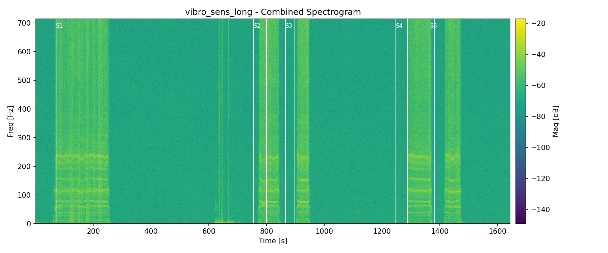

# VibroSens Analysis Tools

This folder contains two Python scripts for analyzing vibration data from the
CSV files in this repo.

## Requirements
- Python 3.10+
- Packages: `numpy`, `scipy`, `matplotlib`
- Optional (for interactive HTML): `plotly`

Install dependencies:
```bash
python -m pip install numpy scipy matplotlib plotly
```

## 1) analyze_vibro.py
Batch analysis: spectra + spectrograms + automatic segmentation.

Basic usage:
```bash
python analyze_vibro.py vibro_sens_long.csv
```

Outputs are written to:
```
analysis_outputs/<file-base>/
```

Energy-based segmentation (adaptive threshold):
```bash
python analyze_vibro.py vibro_sens_long.csv \
  --segment-mode energy \
  --energy-k 6 \
  --min-segment-sec 10 \
  --min-gap-sec 10
```

Key options:
- `--segment-mode gap|energy` (default: gap)
- `--energy-k` (MAD multiplier for energy thresholding)
- `--min-segment-sec` (minimum flight duration)
- `--min-gap-sec` (minimum gap between flights)
- `--energy-window-sec` (RMS smoothing window)
- `--output-dir` (custom output folder)

Outputs include:
- `*_segmentN_spectrum.png`
- `*_segmentN_spectrogram.png`
- `*_combined_spectrogram.png`
- `*_summary.txt`

Example outputs:



## 2) interactive_spectrogram.py
Interactive spectrogram viewer. Works in headless mode via Plotly HTML.

Single axis (combined magnitude):
```bash
python interactive_spectrogram.py vibro_sens_long.csv --axis mag --plotly-out vibro_mag.html
```

All axes stacked:
```bash
python interactive_spectrogram.py vibro_sens_long.csv --axis all --plotly-out vibro_all_axes.html
```

Example (stacked axes):


Useful options:
- `--axis ax|ay|az|mag|all`
- `--fmax 300` (limit max frequency shown)
- `--max-samples 300000` (downsample for speed)
- `--nperseg 2048 --noverlap 1536` (STFT windowing)

### Notes
- The Matplotlib GUI backend does not work in headless environments. Use
  `--plotly-out` to create an interactive HTML you can open in a browser.
